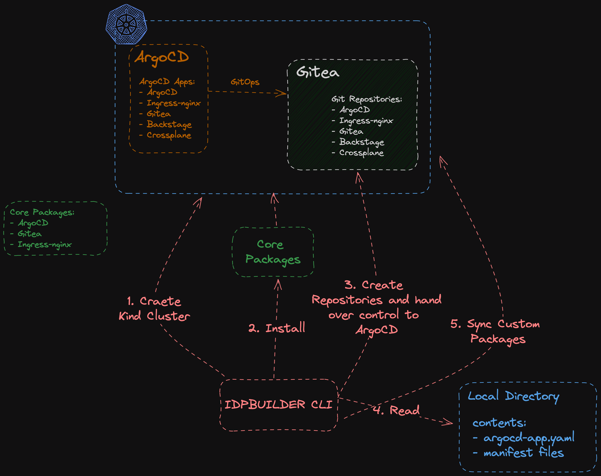

# Architecture

idpbuilder operates in two phases: CLI and Kubernetes controllers.



## CLI Phase

1. Parse command flags into Go structs (notably [`LocalBuild`](../../api/v1alpha1/localbuild_types.go))
2. Create a Kind cluster and update kubeconfig
3. Start three Kubernetes controllers managed by a single controller manager:
   - `LocalbuildReconciler` — bootstraps core packages from embedded manifests
   - `RepositoryReconciler` — creates and manages Gitea repositories
   - `CustomPackageReconciler` — manages custom ArgoCD applications
4. Create CRs for each controller
5. Wait for CRs to reach ready state

## Controller Phase

### LocalbuildReconciler

Bootstraps the cluster from embedded manifests:
1. Install core packages (Gitea, ingress-nginx, ArgoCD)
2. Create `GitRepository` CRs for core packages
3. Create ArgoCD Applications pointing to Gitea repos (GitOps handoff)

### RepositoryReconciler

Creates Gitea repositories. Content is sourced from the embedded filesystem or local filesystem.

### CustomPackageReconciler

Parses ArgoCD Application files. If they use the `cnoe://` URL scheme, creates a `GitRepository` CR with local source and rewrites the Application's `repoURL` to the in-cluster Gitea URL.

```yaml
# Input (custom package)
spec:
  source:
    repoURL: cnoe://busybox

# Output (after CustomPackageReconciler)
spec:
  source:
    repoURL: http://my-gitea-http.gitea.svc.cluster.local:3000/giteaAdmin/idpbuilder-localdev-my-app-busybox.git
```

## Build Pipeline

1. **Build time** (`hack/embedded-resources.sh`): Generates Kubernetes manifests from upstream Helm charts and kustomize bases
2. **Compile time** (`make build`): Embeds generated manifests into the Go binary via `//go:embed` directives
3. **Runtime** (`./idpbuilder create`): Deploys embedded manifests to a Kind cluster

## Embedded Manifests

The default manifests for core packages are in [pkg/controllers/localbuild/resources](../../pkg/controllers/localbuild/resources). These are **generated** — do not edit them directly.

**Generation scripts:**

| Component | Script | Method |
|-----------|--------|--------|
| ArgoCD | [hack/argo-cd/generate-manifests.sh](../../hack/argo-cd/generate-manifests.sh) | `kustomize build` with patches (disable dex/notifications, annotation tracking, path-based routing) |
| Gitea | [hack/gitea/generate-manifests.sh](../../hack/gitea/generate-manifests.sh) | `helm template` with custom values |
| ingress-nginx | [hack/ingress-nginx/generate-manifests.sh](../../hack/ingress-nginx/generate-manifests.sh) | `kustomize build` with patches |

The master orchestration script is [hack/embedded-resources.sh](../../hack/embedded-resources.sh), invoked by `make embedded-resources`.

## Upstream Relationship

This repo is a private, independent copy of `cnoe-io/idpbuilder` (fork relationship broken). The `upstream` remote tracks the original project for cherry-picking. See [Reference/upstream-management.md](../Reference/upstream-management.md) for the workflow.

**Note:** The Go module path (`github.com/cnoe-io/idpbuilder`) intentionally matches upstream to avoid import path churn. References to `cnoe-io` in Go source files and `go.mod` are expected and correct.
